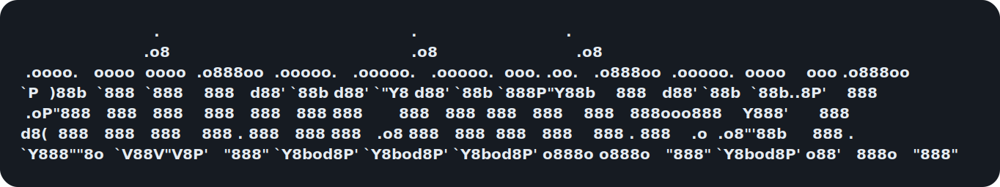

<!-- autocontext-readme-hero:start -->
<p align="center">
  
</p>

<p align="center"><strong>turn repeated agent work into validated, reusable execution</strong></p>
<!-- autocontext-readme-hero:end -->

autocontext runs LLM agents through structured scenarios, evaluates their outputs, and accumulates the knowledge that improved results — so repeated runs get better, not just different. Point the harness at a real task in plain language, let it work the problem, and then inspect the traces, reports, artifacts, datasets, playbooks, and optional distilled model it produces.

<!-- autocontext-whats-new:start -->
## What's New

- All 11 scenario families executable in both Python and TypeScript
- TypeScript campaign API and MCP surfaces shipped for multi-mission coordination
- Provider expansion: Gemini, Mistral, Groq, OpenRouter, and Azure OpenAI
- Evidence and privacy hardening with TruffleHog integration and redaction
- Session-runtime parity across Python and TypeScript surfaces
<!-- autocontext-whats-new:end -->

## What actually is autocontext?

Most agent systems still start every run cold. They do not reliably preserve what worked, separate signal from noise, or turn repeated success into a reusable asset.

autocontext is built to close that loop:

- run a scenario, task, or mission
- evaluate what actually happened
- persist validated knowledge and artifacts
- replay, analyze, or compare results
- distill stable behavior into cheaper local runtimes when it is ready

## How People Use It

- hand the harness a real task, let it iterate mostly hands-off, and review the resulting traces, datasets, playbooks, artifacts, and optional distilled model
- improve agent behavior across repeated runs instead of prompting from scratch every time
- model and test environments through reusable scenarios
- run plain-language simulations with sweeps, replay, compare, and export
- run evidence-driven investigations and analyze the resulting artifacts
- operate verifier-driven missions for longer-running goals
- analyze runs, replays, and artifacts to understand regressions and stable wins
- export knowledge, artifacts, and training data for downstream systems
- expose the system over CLI, MCP, API, and TUI/operator surfaces for external agents and operator tooling

## How It Works

The product model centers on a few stable ideas:

- `Scenario`: a reusable environment or evaluation context with stable rules and scoring
- `Task`: a prompt-centric unit of work that can be evaluated directly or embedded elsewhere
- `Mission`: a long-running goal advanced step by step until a verifier says it is done
- `Campaign`: a planned grouping of missions under long-term goals; today it has partial TypeScript API/MCP support but is not yet a top-level CLI workflow or Python package surface
- `Run`: a concrete execution instance of a scenario or task
- `Verifier`: the runtime check that decides whether a mission, step, or output is acceptable
- `Knowledge`: validated lessons that should carry forward across runs
- `Artifact`: persisted outputs such as replays, checkpoints, reports, packages, and exports
- `Budget` and `Policy`: the constraints and rules that shape how runs and missions are allowed to proceed

Inside a run, autocontext uses a structured multi-agent loop:

- `competitor` proposes a strategy or artifact for the task
- `analyst` explains what happened and why
- `coach` turns that analysis into playbook updates and future hints
- `architect` proposes tools, harness improvements, or structural changes
- `curator` gates what knowledge is allowed to persist

Strategies are then evaluated through scenario execution, staged validation, and gating. Weak changes are rolled back. Successful changes accumulate into reusable knowledge.

## Which Surface Fits Which Job

| Surface       | When to use it                                                                      |
| ------------- | ----------------------------------------------------------------------------------- |
| `run`         | Improve behavior inside a reusable scenario or task across generations              |
| `simulate`    | Model a system, explore parameter sweeps, or compare replayable outcomes            |
| `investigate` | Evidence-driven diagnosis with hypotheses and confidence scoring                    |
| `analyze`     | Inspect or compare runs, simulations, investigations, or missions after the fact    |
| `mission`     | Verifier-driven goal advanced step by step with checkpoints and completion criteria |
| `train`       | Distill stable exported data into a cheaper local runtime                           |
| `replay`      | Inspect what happened before deciding what knowledge should persist                 |

`campaign` now has partial TypeScript API/MCP support for multi-mission coordination, but it is not yet a top-level CLI workflow in either package.

## Choose An Entry Point

- Want the full Python control plane for scenario execution, training, API serving, and operator workflows? Start with `autocontext/`.
- Want the Node/TypeScript package for simulations, investigations, analysis, mission control, operator tooling, and external integrations? Start with `ts/`.
- Want to wire another agent into autocontext? Start with the CLI-first guide in `autocontext/docs/agent-integration.md`.
- Want to contribute or point a coding agent at the repo? Read `CONTRIBUTING.md` and `AGENTS.md`.

## Scenario Families

All 11 families are executable in both Python and TypeScript. TypeScript uses V8 isolate codegen for secure execution; Python uses subprocess-based executors.

| Family             | Evaluation              | What it tests                                                           |
| ------------------ | ----------------------- | ----------------------------------------------------------------------- |
| `game`             | Tournament with Elo     | Turn-based strategy (grid_ctf, othello)                                 |
| `agent_task`       | LLM judge               | Prompt-centric tasks with optional improvement loops                    |
| `simulation`       | Trace evaluation        | Action-trace scenarios with mock environments and fault injection       |
| `artifact_editing` | Artifact validation     | File, config, and schema modification with diff tracking                |
| `investigation`    | Evidence chains         | Diagnosis accuracy with red herring detection                           |
| `workflow`         | Workflow evaluation     | Transactional flows with compensation, retry, and side-effect tracking  |
| `negotiation`      | Negotiation evaluation  | Hidden preferences, BATNA constraints, and opponent modeling            |
| `schema_evolution` | Schema adaptation       | Mid-run state changes where agents must detect stale context            |
| `tool_fragility`   | Drift adaptation        | APIs that drift, requiring agents to adapt to changed tool behavior     |
| `operator_loop`    | Judgment evaluation     | Escalation and clarification judgment in operator-in-the-loop workflows |
| `coordination`     | Coordination evaluation | Multi-agent partial context, handoff, merge, and duplication detection  |

## Core Capabilities

- Persistent playbooks, hints, tools, reports, and progress snapshots across runs
- Staged validation, harness synthesis, and harness-aware execution
- Replays, checkpoints, reports, and exported artifacts for inspection and reuse
- Frontier-to-local distillation with MLX on Apple Silicon
- Notification hooks via Slack, HTTP webhooks, stdout, and composite routing (`AUTOCONTEXT_NOTIFY_*`)
- OpenClaw-facing APIs and agent integration surfaces
- CLI, API server, MCP, and TypeScript/TUI surfaces for operators and external agents

### Providers

Runtime routing across multiple LLM backends:

- **Anthropic** — native Anthropic API and Agent SDK
- **OpenAI-compatible** — any OpenAI-compatible endpoint (vLLM, Ollama, Hermes)
- **Gemini, Mistral, Groq, OpenRouter, Azure OpenAI** — env-driven config in TypeScript
- **MLX** — Apple Silicon local inference
- **Pi** — CLI and RPC-based Pi agent runtimes
- **Deterministic** — reproducible testing without API keys

### Runtimes

Agent runtimes control how agents execute during runs:

- **Claude CLI** and **Codex CLI** — subprocess-based agent execution
- **Hermes CLI** — Hermes gateway runtime
- **Direct API** — in-process API calls
- **Pi CLI, Pi RPC, Pi Artifacts** — Pi agent runtime variants

### Executors

Strategy and code execution backends:

- **Local** — subprocess execution with timeout and memory limits
- **SSH** — remote execution over SSH
- **Monty** — sandboxed execution via pydantic-monty (`AUTOCONTEXT_EXECUTOR_MODE=monty`)
- **PrimeIntellect** — remote sandbox via PrimeIntellect SDK

## Quick Start From Source

The Python application lives in `autocontext/`, and most `uv`, `pytest`, `ruff`, and `mypy` commands should be run from there.

```bash
cd autocontext
uv venv
source .venv/bin/activate
uv sync --group dev

AUTOCONTEXT_AGENT_PROVIDER=deterministic uv run autoctx solve \
  --description "improve customer-support replies for billing disputes" \
  --gens 3
```

That hands the harness a real task, materializes the working scenario, runs the loop, and writes traces and artifacts under `runs/` and `knowledge/`. It also works without external API keys.

Run with Anthropic:

```bash
cd autocontext
AUTOCONTEXT_AGENT_PROVIDER=anthropic \
AUTOCONTEXT_ANTHROPIC_API_KEY=your-key \
uv run autoctx solve --description "improve customer-support replies for billing disputes" --gens 3
```

Start the API server:

```bash
cd autocontext
uv run autoctx serve --host 127.0.0.1 --port 8000
```

Then inspect `http://127.0.0.1:8000/` for the API index, or use `npx autoctx tui` for the interactive terminal UI.

Use the repo-level `.env.example` as the reference for available `AUTOCONTEXT_*` settings.

## Installable Packages

The repo publishes two installable packages with different scopes:

- Python package: `pip install autocontext`
- TypeScript package: `npm install autoctx`
- Current release line: `autocontext==0.3.6` and `autoctx@0.3.6`

Important:

- The Python package on PyPI is now `autocontext`.
- The CLI entrypoint remains `autoctx`.
- The npm package for this project is still `autoctx`.
- `autocontext` on npm is a different package.

The Python package exposes the full `autoctx` control-plane CLI for scenario execution, API serving, exports, training, and operator workflows. The TypeScript package exposes the `autoctx` CLI and library surface for simulations, investigations, analysis, mission control, MCP serving, and Node integrations.

## Which Package Should You Use?

| If you want to...                                                | Start here                                                                     | Why                                                                                                             |
| ---------------------------------------------------------------- | ------------------------------------------------------------------------------ | --------------------------------------------------------------------------------------------------------------- |
| Run the full multi-generation control plane                      | [autocontext/README.md](autocontext/README.md)                                 | Python has the API server, training loop, scenario scaffolding, export/import, and full CLI surface.            |
| Run simulations, investigations, analysis, or missions from Node | [ts/README.md](ts/README.md)                                                   | The TypeScript package is focused on operator-facing workflows, integrations, mission control, and MCP serving. |
| Embed autocontext in a Node app or operator workflow             | [ts/README.md](ts/README.md)                                                   | The TypeScript package also exposes library surfaces for evaluation, artifacts, publishing, and integrations.   |
| Point an external agent at autocontext                           | [autocontext/docs/agent-integration.md](autocontext/docs/agent-integration.md) | It documents the CLI-first contract, JSON output, MCP usage, and SDK options.                                   |
| Grab copy-paste integration snippets                             | [examples/README.md](examples/README.md)                                       | The examples cover Python CLI, Claude Code MCP, Python SDK, and TypeScript library usage.                       |
| Catch up on recent repo evolution                                | [CHANGELOG.md](CHANGELOG.md)                                                   | It summarizes recent public releases and notable changes.                                                       |

## Common Workflows

- Hand the harness a task in plain language: `uv run autoctx solve --description "improve customer-support replies for billing disputes" --gens 3`
- Run and improve a saved scenario: `uv run autoctx run --scenario support_triage --gens 3`
- Inspect or replay outputs: `uv run autoctx list`, `uv run autoctx status <run_id>`
- Scaffold a custom scenario: `uv run autoctx new-scenario --template prompt-optimization --name my-task`
- Export training data: `uv run autoctx export-training-data --scenario support_triage --all-runs --output training/support_triage.jsonl`
- Train a local model: `uv run autoctx train --scenario support_triage --data training/support_triage.jsonl --time-budget 300`
- Start operator surfaces: `uv run autoctx serve --host 127.0.0.1 --port 8000`, `uv run autoctx mcp-serve`
- Wait on a monitor condition: `uv run autoctx wait <condition_id> --json`

Representative TypeScript operator workflows:

- Run a simulation: `npx autoctx simulate -d "simulate deploying a web service with rollback"`
- Run an investigation: `npx autoctx investigate -d "why did conversion drop after Tuesday's release"`
- Analyze an artifact: `npx autoctx analyze --id deploy_sim --type simulation`
- Operate a mission: `npx autoctx mission create --name "Ship login" --goal "Implement OAuth"`

`operator-in-the-loop` is a fully runnable scenario family in both Python and TypeScript. It tests escalation and clarification judgment with real escalation/clarification hooks and behavioral-contract signals across multi-run, sweep, and replay flows.

MLX training is host-only on Apple Silicon macOS. If you want a sandboxed OpenClaw agent to trigger training, use the file-based host watcher flow documented in [autocontext/docs/mlx-training.md](autocontext/docs/mlx-training.md).

## Repository Layout

- `autocontext/`: Python package, CLI, API server, and training loop
- `ts/`: published TypeScript package, CLI, and MCP-compatible tooling
- `docs/`: docs landing page and maintainer checklists
- `examples/`: copy-paste integration snippets for package users and external agents
- `infra/`: Docker, Fly.io, and bootstrap scripts
- `protocol/`: shared protocol artifacts
- `scripts/`: repo maintenance and generation scripts

## Where To Look Next

- Canonical vocabulary and object model: [docs/concept-model.md](docs/concept-model.md)
- Docs overview: [docs/README.md](docs/README.md)
- Analytics and adoption: [docs/analytics.md](docs/analytics.md)
- Python package guide: [autocontext/README.md](autocontext/README.md)
- TypeScript package guide: [ts/README.md](ts/README.md)
- Copy-paste examples: [examples/README.md](examples/README.md)
- External agent integration: [autocontext/docs/agent-integration.md](autocontext/docs/agent-integration.md)
- Recent changes: [CHANGELOG.md](CHANGELOG.md)
- Contributor setup: [CONTRIBUTING.md](CONTRIBUTING.md)
- Repo agent guide: [AGENTS.md](AGENTS.md)
- MLX host training and OpenClaw bridge: [autocontext/docs/mlx-training.md](autocontext/docs/mlx-training.md)
- Sandbox and executor notes: [autocontext/docs/sandbox.md](autocontext/docs/sandbox.md)
- License: [LICENSE](LICENSE)

## Project Signals

[](https://www.npmjs.com/package/autoctx)
[](https://pypi.org/project/autocontext/)

[](https://www.star-history.com/#greyhaven-ai/autocontext&Date)
